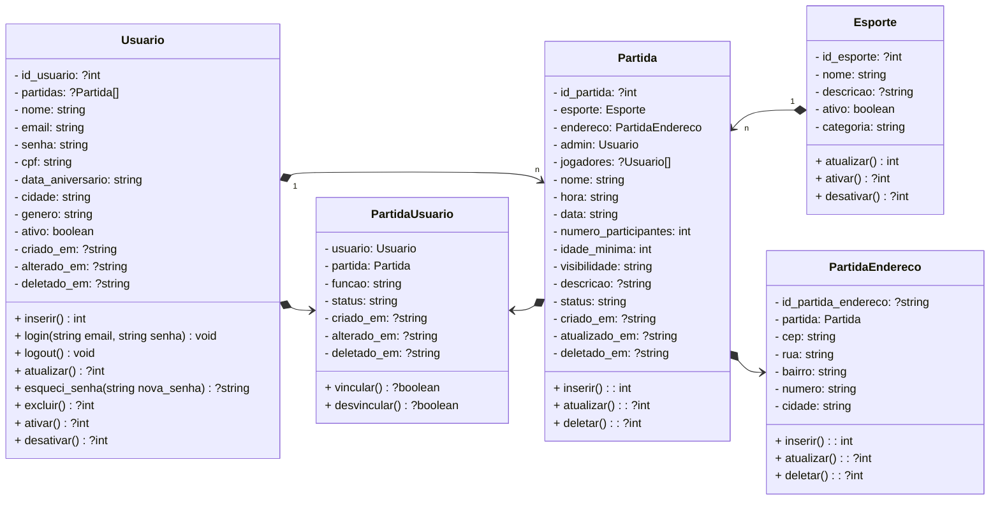

  <picture>
    <source media="(prefers-color-scheme: dark)" srcset="public/assets/images/logos/logo-bora-rachao-white.png">
    <source media="(prefers-color-scheme: light)" srcset="public/assets/images/logos/logo-bora-rachao-black.png">
    
  </picture>
  
  # Plataforma para organização de partidas esportivas
  ### Centro Paula Souza
  ### Faculdade de Tecnologia de Jahu 
  ### Curso de Tecnologia em Desenvolvimento de Software Multiplataforma
  ### Jaú, SP, BR
  ### Início: 1º Semestre / 2025
  # Documento da Aplicação Web

# Autores:
<h3 align="center">
   &nbsp;
  <a href="https://www.linkedin.com/in/beatriz-karoline-monteiro-808b86352/">Beatriz Monteiro</a>;
  <a href="https://www.linkedin.com/in/eullerlourenco/">Euller Lourenço</a>;
  <a href="https://www.linkedin.com/in/gabriel-alexandre-ribeiro-97950026a/">Gabriel Alexandre</a>;
  <a href="https://www.linkedin.com/in/jo%C3%A3o-francisco-fabbri-fonseca/">João Francisco</a>;
  <a href="https://www.linkedin.com/in/lucas-bardeli/">Lucas Bardeli</a>.
</h3>

<h1>Sumário</h1>

  - [1. Resumo da aplicação web](#1-resumo-da-aplicação-web)
    - [1.1. Objetivos](#11-objetivos)
    - [1.2 Métodos da pesquisa](#12-métodos-da-pesquisa)
  - [2. Documento de requisitos](#2-documento-de-requisitos)
    - [2.1. Requisitos funcionais](#21-requisitos-funcionais)
    - [2.2. Requisitos não funcionais](#22-requisitos-não-funcionais)
  - [3. Regras de negócio](#3-regras-de-negócio)
    - [3.1. O que será elaborado?](#31-o-que-será-elaborado)
    - [3.2. Como será elaborado?](#32-como-será-elaborado)
    - [3.3. Para quem será elaborado?](#33-para-quem-será-elaborado)
    - [3.4. Quanto custará?](#34-quanto-custará)
  - [4. Estudo de viabilidade](#4-estudo-de-viabilidade)
  - [5. Design](#5-design)
  - [6. Protótipo](#6-protótipo)
  - [7. Aplicação](#7-aplicação)
  - [8. Diagramas da aplicação](#8-diagramas-da-aplicação)
    - [8.1 Diagrama de Casos de Uso](#81-diagrama-de-casos-de-uso)
    - [8.2 Diagrama de Classes](#82-diagrama-de-classes)
    - [8.3 Diagrama de Banco de Dados](#83-diagrama-de-banco-de-dados)
  - [9. Considerações finais](#9-considerações-finais)
  - [Referências bibliográficas](#referências-bibliográficas)

# 1. Resumo da Aplicação Web
Atualmente, muitas pessoas enfrentam dificuldades para organizar partidas esportivas por meio das redes sociais. É comum a criação de grupos no WhatsApp ou Facebook para marcar jogos, como de vôlei, por exemplo, mas a falta de comunicação eficaz muitas vezes impede que essas partidas realmente aconteçam.

Outro obstáculo é a limitação de acesso a dispositivos como celulares ou notebooks. Pensando nisso, nosso site foi desenvolvido para ser acessível a partir de qualquer dispositivo com acesso à internet, facilitando a participação dos usuários.

Além disso, muitos usuários enfrentam o desafio de não conhecer pessoas interessadas no mesmo esporte. A nossa plataforma também soluciona esse problema, permitindo que qualquer pessoa encontre e se conecte com outros jogadores que desejam praticar o mesmo esporte, mesmo que nunca tenham se conhecido antes.

## 1.1. Objetivos
Este projeto interdisciplinar (P.I.) visa desenvolver uma Plataforma Web, cujo objetivo é facilitar a organização de partidas esportivas e promover a conexão entre pessoas com interesses em comum. A plataforma permite que os usuários encontrem outros jogadores para praticar esportes e compartilhar experiências. 

De forma simples e intuitiva, o usuário pode acessar o site, visualizar as partidas disponíveis e se inscrever naquelas que despertarem seu interesse. Assim, incentivamos a prática esportiva, a socialização e a formação de novas amizades por meio do esporte. 

## 1.2. Métodos da Pesquisa
A pesquisa e o desenvolvimento do projeto estão sendo realizados com o apoio da infraestrutura disponibilizada pela Fatec de Jahu. As atividades ocorrem tanto durante as aulas quanto nos períodos livres, utilizando os computadores dos laboratórios da instituição, bem como os computadores pessoais dos integrantes da equipe. 

As tecnologias utilizadas até o momento incluem HTML, CSS, JavaScript e Tailwind CSS para a construção da interface e estrutura da aplicação. O protótipo visual está sendo desenvolvido por meio da ferramenta Figma, que permite a criação colaborativa de interfaces. Além disso, está sendo utilizada a biblioteca Font Awesome para a inserção de ícones que enriquecem a experiência do usuário. Para o desenvolvimento do back-end, será empregado PHP em conjunto com o framework Laravel e o banco MySQL. O código é desenvolvido no VS Code e versionado com Git, garantindo organização e controle das alterações.

<h3 align="center">
   &nbsp;&nbsp;
   &nbsp;&nbsp;
   &nbsp;&nbsp;
   &nbsp;&nbsp;
   &nbsp;&nbsp;
   &nbsp;&nbsp;
   &nbsp;&nbsp;
   &nbsp;&nbsp;
   &nbsp;&nbsp;
  
</h3>

Todo o trabalho está sendo conduzido nas dependências da Fatec de Jahu, local que oferece o suporte necessário para o desenvolvimento do projeto. As atividades estão sendo realizadas durante o primeiro semestre do curso, em alinhamento com os conteúdos estudados nas disciplinas, o que possibilita a aplicação prática dos conhecimentos adquiridos em sala de aula. 

[Voltar para o início](#inicio)

# 2. Documento de Requisitos
Um documento de requisitos de sistema é um arquivo que descreve o que o sistema deve fazer e como ele deve funcionar. Ele serve para orientar a equipe de desenvolvimento e garantir que todos entendam as necessidades do projeto. Nele estão incluídas as funções principais do sistema, regras importantes e características como segurança e facilidade de uso.

## 2.1. Requisitos Funcionais

<h3>Requisitos que foram implementados</h3>

### RF1 - Exibir informações sobre a equipe do P.I
O site deve ter uma aba “Sobre” que mostra as informações dos integrantes do projeto, como: nome, informações de currículo, informações de contato (telefone e e-mail) e perfil do LinkedIn.
### RF2 - Validação de dados
Nos campos em que o usuário digita as informações, tanto de login e cadastro, e criação da partida, terá uma verificação do conteúdo digitado, através de limitações de caracteres, campos obrigatórios e preenchimento automático.
### RF3 - Exibir página de políticas de privacidade
O sistema deve exibir uma página com as políticas de privacidade, para os usuários poderem ver como os dados deles são armazenados e utilizados pelo projeto.
### RF4 - Exibir página de termos de uso
O sistema deve exibir uma página com as políticas de privacidade, para os usuários poderem ver como os dados deles são armazenados e utilizados pelo projeto.
### RF5 - Exibir página de contato
O sistema deve exibir uma página com um formulário de contato para os usuários poderem enviar mensagens para a equipe.

<h3>Requisitos que serão trabalhados</h3>

### RF6 - Cadastrar usuário
O sistema deve permitir o cadastro de usuários com os seguintes atributos: Nome completo, e-mail, senha, cidade, gênero, cpf e data de nascimento.
### RF7 - Confirmar e-mail
O usuário deve confirmar o e-mail informado com o código enviado no e-mail dele. 
### RF8 - Inserir foto própria de perfil
O sistema exigir do usuário uma foto própria para ingressar em uma partida.
### RF9 - Realizar login
O sistema deve apresentar ao usuário uma tela para fazer o login com e-mail e senha.
### RF10 - Inserir informações adicionais
O usuário, após fazer cadastro, pode inserir informações adicionais no perfil para participar de uma partida, como: biografia. 
### RF11 - Editar informações do usuário 
O usuário pode editar as informações do seu perfil, como: nome de usuário, endereço de e-mail, senha, cidade, foto de perfil e biografia. 
### RF12 - Listar partidas disponíveis
O sistema deve listar as partidas disponíveis que os usuários criaram, que estão disponíveis na região do usuário. 
### RF13 - Criar partidas
O sistema deve ter um formulário para o usuário criar sua própria partida, atributos: esporte, nome da partida, data e hora, localização, número de participantes e idade mínima. Atributos opcionais: gênero, descrição e convidar amigos. 
### RF14 - Editar as partidas pendentes
O sistema permite o criador editar a partida que ainda não foi realizada, editar número de participantes e a descrição do evento, com um limite de tempo para essa ação. 
### RF15 - Cancelar partidas
- Criador: O criador da partida pode cancelar a partida que ele criou. 
- Usuário: Os usuários podem cancelar sua participação nas partidas que ele se inscreveu. 
### RF16 - Avaliar partidas finalizadas
Os usuários podem avaliar as partidas que ele participou depois que elas encerraram.
### RF17 - Mandar pedidos de amizade
Os usuários podem enviar pedidos de amizade para outros usuários.
### RF18 - Receber pedidos de amizade
O usuário pode receber pedidos de amizades de outro usuário. 
### RF19 - Convidar amigos para as partidas
O usuário pode chamar os amigos para participar da partida depois que ela foi criada, através dos amigos adicionados no site, ou por uma mensagem em algum canal de comunicação (mandar no privado de alguém, ou compartilhar nas redes sociais).

## 2.2. Requisitos Não Funcionais

<h3>Clique para exibir</h3>

### RNF1 - O sistema deve proteger os dados
Os dados do usuário devem ser protegidos e não serem compartilhados ou acessados além da equipe de desenvolvimento e o dono das informações (usuário). 
### RNF2 - O sistema deve ter um bom desempenho
O tempo de resposta do site deve ser de no máximo 5 segundos para cada transação e respostas, como, por exemplo, a ação de trocar de páginas e login efetuado com sucesso. 
### RNF3 - O design deve ser intuitivo, e bonito
A interface da aplicação deve ser agradável para quaisquer usuários que a utilizem, e de fácil entendimento. 
### RNF4 - Acessibilidade 
O sistema deve ser elaborado de forma que usuários com diferentes necessidades possam utilizar o software sem dificuldades.  

[Voltar para o início](#inicio)

# 3. Regras de negócio
### Figura 1 - Modelo de Negócios Canvas:

  

## 3.1. O que será elaborado?
### Proposta de Valor:
  - Facilitar a organização de partidas esportivas;
  - Promover a conexão entre pessoas com interesses em comum;
  - Encontrar outros jogadores para praticar esportes e compartilhar experiências.

## 3.2. Como será elaborado?
### Parceiros Chave:
  - Prefeitura da cidade;
  - Quadras públicas e particulares;
  - Faculdade de Tecnologia de Jahu (Fatec - Jahu);
  - Eventos esportivos (por exemplo: corridas, jogos de futebol e campeonatos) para a divulgação.
### Atividades Chave:
  - Criar partidas esportivas;
  - Divulgar partidas esportivas;
  - Participar de uma partida;
  - Criar conexões e amizades.
### Recursos Chave:
  - Internet de qualidade para fazer a aplicação;
  - Computadores disponíveis para a programação e criação de arquivos, como a documentação;
  - Plataforma de hospedagem;
  - Servidor dedicado (banco de dados e aplicação).

## 3.3. Para quem será elaborado?
### Segmentos de mercado:
  - Esportes;
  - Saúde.
### Relacionamento com o Cliente: 
  - Plataforma gratuita com possibilidade de assinatura;
  - Pessoas de qualquer idade, gênero, localidade etc;
  - Ambiente seguro, confiável e acolhedor.
### Canais: 
  - Aplicativo mobile;
  - Aplicação web;
  - Redes sociais para divulgação;
  - Recomendação de usuários.

## 3.4. Quanto custará?
### Estrutura de Custos: 
  - Domínio da aplicação;
  - Desenvolvimento e manutenção;
  - Custo de patente;
  - Suporte ao cliente.
### Fontes de Renda: 
  - Anúncios no site da aplicação;
  - Planos de assinatura para uma melhor experiência e ter prioridade nos serviços;
  - Doações opcionais caso o usuário queira ajudar o projeto.

[Voltar para o início](#inicio)

# 4. Estudo de Viabilidade
### Viabilidade Técnica: 
A viabilidade técnica do projeto é assegurada pela infraestrutura e pelos recursos tecnológicos disponibilizados pela Fatec de Jahu, os quais se mostram suficientes para a sua elaboração. As ferramentas escolhidas são compatíveis com os conteúdos abordados nas disciplinas do curso, como é o caso do Tailwind CSS, que contribui significativamente para a produtividade no desenvolvimento da interface. A equipe está em processo de adaptação às novas tecnologias, aprendendo por meio de estudos e da aplicação prática dos conhecimentos adquiridos nas aulas. 

### Viabilidade Financeira: 
Em relação à viabilidade financeira, o projeto demonstra ser totalmente acessível, uma vez que, até o momento, não envolve a utilização de ferramentas ou plataformas que exijam investimentos financeiros. Os recursos empregados são gratuitos ou de código aberto, o que elimina custos adicionais. Além disso, o investimento de tempo e esforço dedicado ao projeto é compensado pelo aprendizado ao longo do processo. 

### Viabilidade de Mercado: 
No que se refere à viabilidade de mercado, acredita-se que o projeto tem potencial para obter uma boa aceitação por parte dos usuários, considerando a carência de soluções similares no mercado. A proposta apresenta um diferencial inovador ao facilitar a organização de partidas esportivas e promover a conexão entre pessoas com interesses em comum, o que pode despertar o interesse de um público amplo e diversificado. 

### Viabilidade Operacional: 
Quanto à viabilidade operacional, projeta-se que o sistema será funcional na prática, atendendo às necessidades reais de seus usuários. A expectativa é de que, ao ser finalizado com as tecnologias e os conhecimentos adequados, o sistema esteja apto a cumprir os objetivos propostos, oferecendo uma solução eficiente e acessível para os problemas identificados na fase inicial do projeto. 

[Voltar para o início](#inicio)

# 5. Design
### Paleta de Cores:

| Nome                 | Hexadecimal | Tailwind CSS | Cor |
|----------------------|:-----------:|:------------:|:---:|
| Primária (azul)      | #06B6D4     | cyan-500     |  |
| Secundária (laranja) | #F97316     | orange-500   |  |
| Terciária (verde)    | #84CC16     | lime-500     |  |
| Cinza (neutra)       | #6B7280     | gray-500     |  |
| Vermelho (alerta)    | #DC2626     | red-600      |  |
| Amarelo (aviso)      | #F59E0B     | amber-500    |  |

### Tipografia: 
- [Inter - Google Fonts](https://fonts.google.com/specimen/Inter)

### Modelo de Navegação:

[Voltar para o início](#inicio)

# 6. Protótipo
- ### Link dos protótipos com a ferramenta Figma: [Figma - BoraRachão](https://www.figma.com/design/1Vfxmgct3dibgEcS9vYykD/Prot%C3%B3tipos-Logo-Bora-Rach%C3%A3o-PI-2025_1?t=95Vlw8t9649WFMU2-0)

- ### Figura 2 - Protótipo da página principal Home:

  

- ### Figura 3 - Protótipo da tela de perfil do usuário:

  

[Voltar para o início](#inicio)

# 7. Aplicação
- ### Link para o nosso repositório do GitHub: [Repositório - BoraRachão](https://github.com/eullerlourenco/bora-rachao/)
  
- ### Figura 4 - Página Home:

  

- ### Figura 5 - Página Perfil do Usuário:

  

[Voltar para o início](#inicio)

# 8. Diagramas da aplicação
Os diagramas da aplicação representam de forma visual a estrutura e o funcionamento do sistema, auxiliando na compreensão e no planejamento do projeto. Por meio da notação UML, é possível visualizar as principais interações, classes e entidades do banco de dados, facilitando o entendimento entre todos os envolvidos no desenvolvimento.

## 8.1. Diagrama de Casos de Uso
Mostra como os usuários interagem com o sistema e quais são as principais funcionalidades disponíveis. Ajuda a identificar os papéis dos atores e os fluxos de uso da aplicação.
- ### Figura 6:

  

## 8.2. Diagrama de Classes
Apresenta a estrutura interna do sistema, mostrando as classes, seus atributos, métodos e relacionamentos. Permite compreender a organização do código e a relação entre os componentes.

## 8.3. Diagrama de Banco de Dados
Representa as tabelas e os relacionamentos que compõem a base de dados do sistema. Serve para planejar e documentar a forma como as informações serão armazenadas e conectadas.
- ### Figura 7:

  

[Voltar para o início](#inicio)

# 9. Considerações Finais
A aplicação destaca-se pela capacidade sua de personalização das partidas e perfil oferecidos aos usuários, porém causa o aumento do escopo e demanda de recursos humanos e materiais. 

As limitações foram os requisitos que serão implementados futuramente como, sistema de avaliação para a partida, implementar chat na partida, sistema para criação de times dentro da partida, sistema de postagem de fotos da partida. 

Houve desafios para criação da logo e ideias para implementar no PI. Mas em contrapartida foi sucesso! 

[Voltar para o início](#inicio)

# Referências Bibliográficas
ATLASSIAN. Trello. 2025. Disponível em: [https://trello.com/](https://trello.com/). Acesso em: 10 jun. 2025. 

FIGMA, Inc. Figma: the collaborative interface design tool. 2025. Disponível em: [https://www.figma.com/](https://www.figma.com/). Acesso em: 10 jun. 2025.

FONTICON, Inc. Font Awesome. 2025. Disponível em: [https://fontawesome.com/](https://fontawesome.com/). Acesso em: 10 jun. 2025. 

MIND THE GRAPH. O que é um estudo de viabilidade em pesquisa? 2023. Disponível em: [https://mindthegraph.com/blog/pt/o-que-e-um-estudo-de-viabilidade-em-pesquisa/](https://mindthegraph.com/blog/pt/o-que-e-um-estudo-de-viabilidade-em-pesquisa/). Acesso em: 20 mai. 2025. 

SEBRAE. Canvas Sebrae. 2025. Disponível em: [https://canvas-apps.pr.sebrae.com.br/canvas](https://canvas-apps.pr.sebrae.com.br/canvas). Acesso em: 22 abr. 2025. 

TAILWIND LABS. Tailwind CSS: Rapidly build modern websites without ever leaving your HTML. 2025. Disponível em: [https://tailwindcss.com/](https://tailwindcss.com/). Acesso em: 10 jun. 2025. 

W3SCHOOLS. W3Schools: tutorial de desenvolvimento web. 2025. Disponível em: [https://www.w3schools.com/](https://www.w3schools.com/). Acesso em: 10 jun. 2025. 

LARAVEL. Laravel - The PHP Framework for Web Artisans. Disponível em: [https://laravel.com/](https://laravel.com/). Acesso em: 7 nov. 2025.

MERMAID. Mermaid - Diagramming and charting tool. Disponível em: [https://www.mermaidchart.com/](https://www.mermaidchart.com/). Acesso em: 23 ago. 2025.

CANVA. Canva - Crie designs incríveis e gratuitos. Disponível em: [https://www.canva.com/](https://www.canva.com/). Acesso em: 6 out. 2025.

DRAW.IO. draw.io - Security-first diagramming for teams. Disponível em: [https://www.drawio.com/](https://www.drawio.com/). Acesso em: 21 out. 2025.

[Voltar para o início](#inicio)
